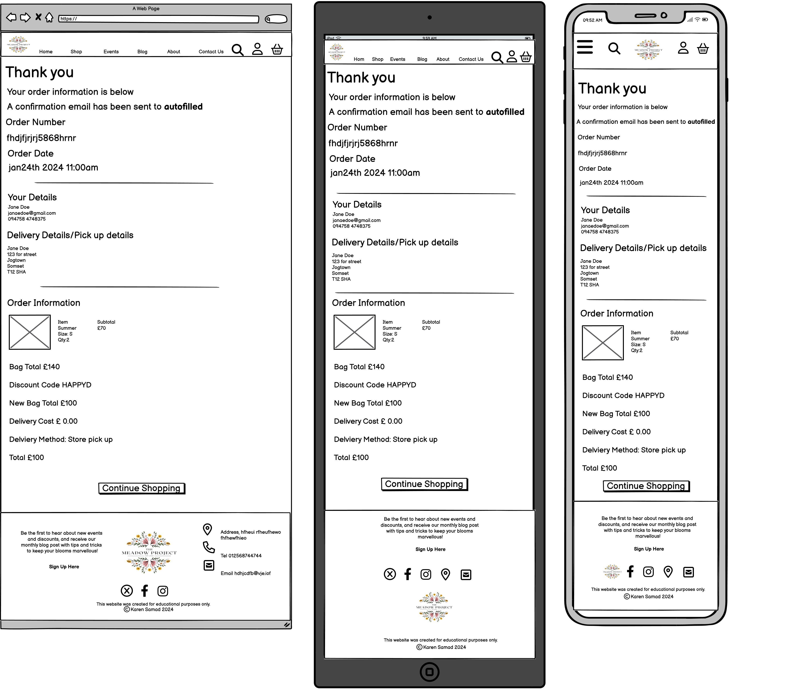
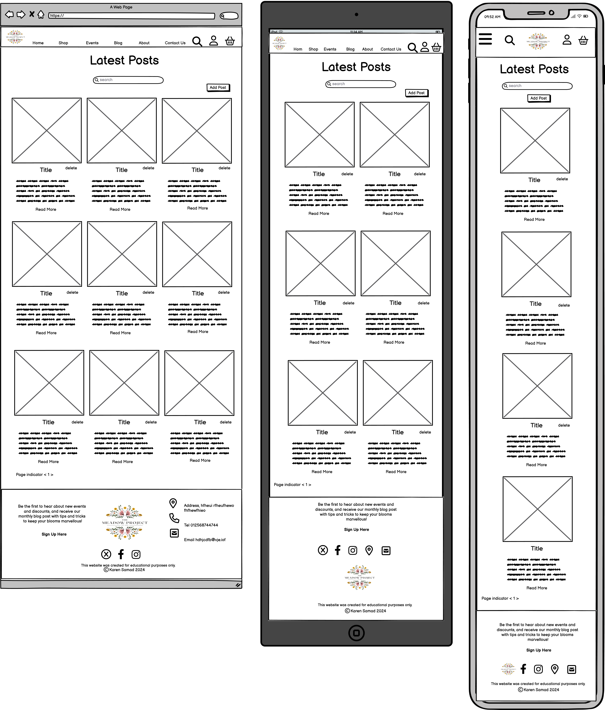
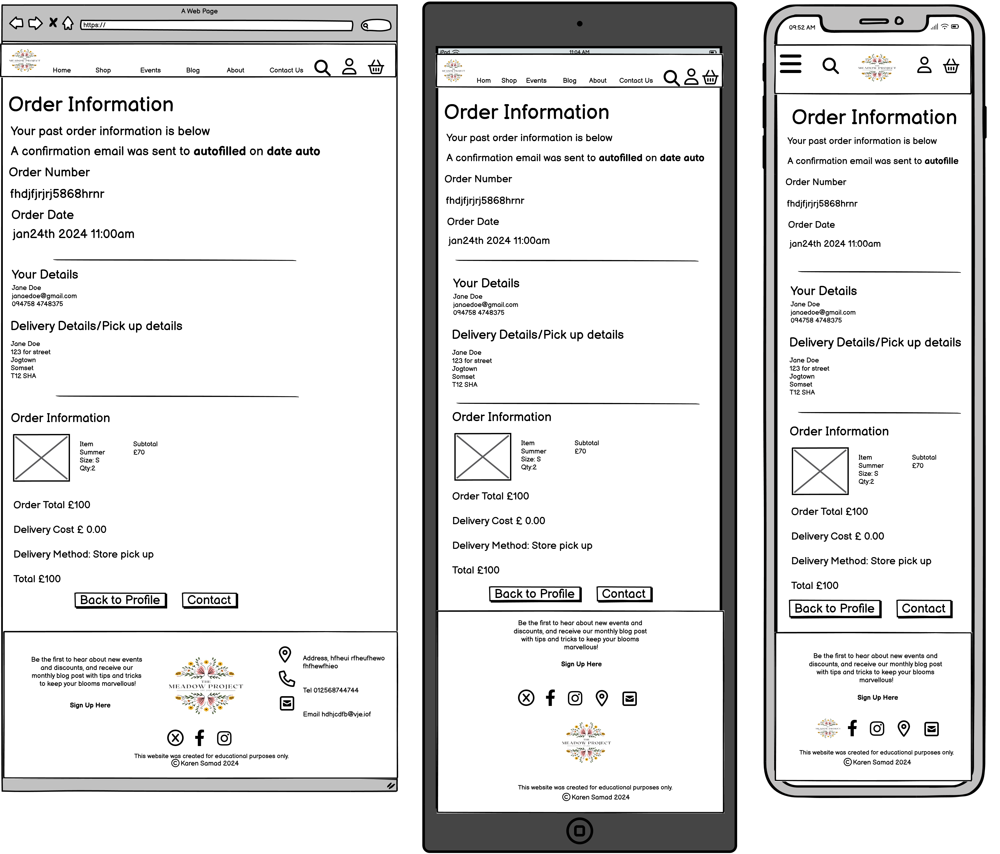

# The Meadow Project #
[The Meadow Project Live Site]()  

Summary of the site

Events
Meadow Project Bristol
Flowers and Plants delivered

Please note, The Meadow Project is a fictional company created to fulfill Project 4 as part of the Code Institute's course. All content has been created as if it were a real business fulfilling a real-life objective.

## Contents 

## Background 

Nature is a gateway to relaxation and tranquility. Studies show that exposure to nature can reduce stress, enhance mood, and improve overall well-being.  For those who can't escape into nature as often as they'd like, The Meadow Project aims to bring the outdoors in. Our goal is to infuse homes with locally grown, seasonal flowers together with oxygenating house plants, recreating the calming effects of nature indoors. 

Our commitment to sustainability is second to none. The Meadow Project transforms disused farmland into vibrant greenbelts that enrich wildlife. We prioritise eco-friendly deliveries using bicycles and zero-emission vans. By growing locally and seasonally, we ensure a low carbon footprint and deliver the freshest blooms. Visitors are welcome to enjoy our fields, participate in our events, and join our online community of like-minded individuals with access to engaging blog posts from the owners.

### Mission Statement 

To deliver sustainable flowers and plants and host engaging events for Bristol residents.

### Target Audience 

* Gardeners and hobbyists looking for tips and events on sustainable gardening practices.
* Residents of Bristol looking for locally grown flowers and plants.

### WebApp Business Objectives 

* Have a minimalist, well-designed site that conveys the company ethos and quality.

* Have intuitive links and features that inspire confidence in the company and encourage users to shop/book events.

* Incentivise customers to sign up for the site, engage with posted content, and make repeat purchases.

### Interviews

Short interviews were carried out with the stakeholders and potential customers to determine the key features and objectives of the site. 

#### Stakeholders

1. "What information/features would you like to be visible to users"

    *   Display the bouquets and plants sold with descriptions and size options.
    *   Notifications letting the customer know if an item is low in stock.
    *   Prices.
    *   Abiilty to make purchaces from the site including delivery info.
    *   Advertisment of the events available at the meadow.
    *   Events page with availability calender + booking system.
    *   Blog with an option for registered users to comment.
    *   Customer profiles with saved info and previous order history.
    *   Contact forms (1 x order-related and 1 x general).
    *   Ability for registered users to receive and use discount codes.
    *   Allow the user to easily find products they are looking for, e.g., either bouquets, plants, or events, etc.
    *   Incentive for customers to spend £30 and get free delivery.
    *   Emphasis that we deliver by bike where possible.
    *   About page explaining the company and how it runs.
    *   A live chat feature for customer support. 

2. "What would you like to be visible to admin users"

    *   Option to add/delete products and product catagories to the site.
    *   Ability to add a Blog Post.
    *   Option to delete any malicious blog comments.
    *   Ability to add events and amend info of previously posted events. 
    *   Ability to retrieve email list of registered users to send out updates and discounts.
    *   Ability to set up and manage discount codes and special offers.
    *   Abiity to manage stock.

3. "Are there any other key features or ideas you'd like to incorporate into the site?"

    *   We'd like the site to be sleek and simple, using muted colours to convey a sense of calm and quality.    
    *   We'd like a company logo and other visual features that encompass the site's ethos. 
    *   We want the site to integrate with a users social media platform.
    
#### Users

Users were shown relavent answers from the stakeholders and were then asked: 

1. "Apart from the features mentioned above, is there anything you'd like to know in order to make a purchace from a florst website"

    *   Cost of postage.
    *   Delivery time scale.
    *   I'd want to be able to select a specific delivery date.

2. "From an online florist website are there any particular features you would like to see?"

    *   I'm not very good a exploring websites, so would like to see adverts or promts on the site saying workshops can be booked. I might not know they were there otherwise.
    *   I'd like to be able to give a colour preference to my bouquet.
    *   I'd like to be able to select plants based on position preferences (eg sunny spot or shade).
  
3. "Is there anything that would incentivise you to shop?"

    *   I'd be more likely to order from a local florist so emphasis on that.
    *   I like seeing reviews so I know how the flowers have lasted, if they were delivered in good condition etc. 
    *   Sometimes it's nice to give someone the option of chosing a bouqet themselves so I'd use a gift card option.

## User Experience Design

Applying User Experience (UX) design principles, I incorporated insights from stakeholder and user interviews to design the web app's features. This approach ensures the site is user-friendly, driving customer engagement while providing the necessary functionality for the business.

### Project Strategy

#### User Demographics

* The primary user of this site will be a Bristol-based resident seeking local delivery of ethically grown flowers and plants cultivated within their community, or individuals trying to find local workshops incorporating floristry techniques.

* A secondary user of the site will be someone wishing to visit the meadow through the meadow walk events. 

The overall emphasis of the site will be on local community engagement, simplicity, and ethical practices with a design that displays the beauty, and tranquiltiy of flowers/plants in the home or seen at the events in the meadow. 

#### User Stories

1. As a **potential customer**, I want to be able to:

* Immediately understand the purpose of the site and get a sense of its ethos.
* Navigate to areas of interest quickly and easily.
* Filter what products I'm looking for.
* Visit the site on all my devices.
* Find and understand key information about products including descriptions, costs, and delivery information so I can make an informed purchasing decision.
* Understand what the company stands for and see it aligns with my values.
* Pick a delivery date that suits me.
* Add a message with my bouquet/plant delivery
* Add a note to my order to say to avoid roses, or yellow flowers.
* Learn about future events I might want to sign up for.
* View where the company is based so I can see if event attendance is possible.
* Read reviews from other customers to help me make an informed purchasing decision.
* Sign up for the site's newsletter so I can be informed about new events, products, and rewards.
* Contact the business to ask any questions before making a purchase.
* Add products to my basket, so I can make a purchase when I'm ready to and have confidence they have been added succesfully.
* View my basket and identify how much my order might cost me.
* See adverts for part of the site I might not have thought of.
* Follow the companies social media platforms. 

As a **buying customer** , I would also like to be able to:

* Easily input my delivery and card information.
* Register on the site so I can make further purchases more easily.
* Opt out of receiving the newsletter.
* Remove unwanted items from my basket. 
* Be able to add more than one person to an event's booking.
* Recieve an email confirmation of my order once complete.

As a **registerd user**, I would also like to be able to:

* Sign into my account.
* Find previous oders easily and see a sumarry.
* Contact the business about a specific order.
* Update my details.
* Change my password.
* Reset my password if I forget it.
* Sign out of my account.
* Add/Edit reviews to products to help others be informed about their purchasing decsions. 

As a **business owner** user, I would like to be able to:

* Add, edit, and delete events on the site quickly and easily.
* View an event summary, including who is booked for each event.
* Have immediate access to customer information, including those registered to receive our newsletter and discounts.
* Amend the reward codes the site is accepting.
* Edit and delete products and their prices.
* Delete user reviews (if malicious).
* Add and edit product categories.
* Track sales data to see which products are most popular and help with stock control.
* Add a note to the site, e.g., information about Mother's Day bookings/delivery.
* Add a blog post to the site.
* Control stock.
* Receive emails from users who contact the business via the contact form(s)

#### Constraints

The developer of this site is a junior, currently undergoing training in Python and Django while still perfecting industry standards for web design. Certain features may be beyond the developer's current skill set. Additionally, as the developer is working on the site part-time whilst balancing other responsibitlies, prioritisation of features is necessary to complete the project on time. Features not achieved in the initial phase will be rolled out in future deployments.

#### Opportunity Matrix

Opportunity|User|Importance|Viability|Score|Planned Development Phase|
-----------|----|----------|---------|-----|-----------------|
All pages - Navbar containing page links, user features, search, and basket | All | 5 | 5 | 10 | 1 |
All pages - Footer containing social links, contact info, copyright, and disclaimer | All | 5 | 5 | 10 | 1 |
Registration Form - To enable new users to sign up | All | 5 | 5 | 10 | 1 |
Landing Page - Brand and summarising features/text | All | 5 | 5 | 10 | 1 |
About Page - Outlining company values and other general info | All | 5 | 5 | 10 | 1 |
Contact Page - General enquiries | All | 5 | 5 | 10 | 1 |
Subscription - Form to allow users to subscribe to the newsletter and receive discounts | All | 5 | 3 | 8 | 1 |
Products Page (1) - Showcase of all products within a category (filterable), short description, price | All | 5 | 5 | 10 | 1 |
Products Page (2) - One product only, more details with options required for purchasing/adding to basket (size, notes, date etc). | All | 5 | 5 | 10 | 1 |
Events Page (1) - Showcase of all products within a category, short description, price, date, and places available | All | 5 | 5 | 10 | 1 |
Events Page (2) - One event only, more details with options required for purchasing/adding to basket (date, places booking, names etc). | All | 5 | 5 | 10 | 1 |
Basket - Visible when an item is added (summary) and on a separate page (order summary). Option to remove unwanted items from either place | All | 5 | 5 | 10 | 1 |
Checkout - Form for user details (which can be saved if details need updating), secure checkout, discount code input and then email confirmation of order | All | 5 | 5 | 10 | 1 |
Log In - Sign into user profile | Registered but signed out user | 5 | 5 | 10 | 1 |
Password Reset | Registered but signed out user | 5 | 3 | 8 | 1 |
Checkout - Form auto inputted with saved details | Signed In User | 5 | 5 | 10 | 1 |
User Profile - Order summaries, access to quick order related contact form, and displayed user details (address, email etc) | Signed In User | 5 | 5 | 10 | 1 |
User Profile - Amendments from to change user details/password | Signed In User | 5 | 5 | 10 | 1 |
Review Product - Leave a comment and star rating for products on the site | Signed In User | 3 | 2 | 5 | 1 |
Contact Page - Order-specific enquiries | Signed In User | 5 | 5 | 10 | 1 |
Log Out - returned to landing page | Signed In User | 5 | 5 | 10 | 1 |
Add, Edit and Delete Product from the site | Admin User | 5 | 5 | 10 | 1 |
Add, Edit and Delete Discounts codes from the site | Admin User | 4 | 3 | 7 | 1 |
Add, Edit and Delete category for products from the site | Admin User | 3 | 5 | 8 | 2 |
Option to Add or delete a blog post | Admin User | 4 | 4 | 8 | 1 |
Delete review | Admin User | 5 | 5 | 10 | 1 |
Track sales data | Admin User | 3 | 2 | 5 | 2 |
Add/Edit info to banner display for key calendar events | Admin User | 4 | 4 | 5 | 1 |
Custom error pages | All | 5 | 5 | 10 | 1 |

### Project Sructure

The structure of the site was designed by refering to the [User Stories](README.md#user-stories) and the opportunities outlined in the [Opportunity Matrix](README.md#opportunity-matrix).

This site map outlines the design of the website and which pages are accesible to which user. 

This table outlines the design for the PostgreSQL database which will be used to store the data. It is a relational database that will be integrated with Django, enabling seamless database interactions. Django's ORM (Object-Relational Mapping) will allow me to define database models in Python, perform CRUD (Create, Read, Update, Delete) operations, and dynamically generate HTML content within my application.

The database will be integrated into The Meadow Project's Django framework under the following apps:

* Home: Manages the homepage content and main navigation.
* Products: Handles product listings and details.
* Events: Manages event listings and details.
* Basket: Manages the shopping cart functionality.
* Discounts: Manages the discount functionality.
* Checkout: Handles the checkout process and order completion.
* Blog: Manages blog posts and related content.
* Users: Handles user profiles and account settings.
* Reviews: Manages user reviews.

These apps will all reside under a centralised project called The Meadow Project.

### Project Skeleton

#### Wireframes

[Balsamiq Wireframes](https://balsamiq.com/) was utilised to create detailed mockups of the project's pages.

I am showing an expanded display of the mobile and tablet designs to ensure thorough planning of content placement.

Home/Landing Page

About Page

Shop Pages

All Products: 

One Category (not event):

Individual Product (not event):

All Events

One Event:

Admin Only, Add Product/Event (both pages are shown on one design here but they will be two separate pages):

Basket Page

Review Page

Checkout Pages

Checkout 1

Checkout 2

Checkout 3

Checkout 4

Checkout Confirmation

Contact Pages

General Contact

Order Specific Contact

Blog Pages

All Posts

Individual Post

Admin only ability to add a blog post

Login/Register Pages

User Profile Pages

### Surface Design

#### Logo and Typography

I utilised [Canva](https://www.canva.com) to design my logo, aiming for a simple and clean image that evokes floral design, calmness, and beauty. I customised a template, focusing on colors that complement the site's imagery. The font was modified to use a freely available Google font, EB Garamond, which appears clean and stylish, conveying sophistication and professionalism to clients.

This font will be paried with Lexend. This was selected after reading the article by google fonts titled ["Introducing accessibility in typography"](https://fonts.google.com/knowledge/readability_and_accessibility/introducing_accessibility_in_typography). It states that Lexend was designed to be easier to read for all users, ensuring each character is distinctive from others.

### Colour Scheme

The site's color scheme was inspired by my logo design, incorporating the primary colors #FFBD59 (Hunyadi Yellow), #DC6874 (Bright Pink), #04724D (Dark Spring Green), and #E26016 (Spanish Orange). These colors will be used sparingly as accents to maintain a clean, sleek, and stylish design. The minimal use of color ensures that the product colors are prominently emphasised.

## Finished Site Features

### Imagery

## Technologies

### Languages

HTML, CSS, JavaScript & Python

### Database

### Storage

### Payment

### Frameworks

* [Django](https://www.djangoproject.com/) - web development framework.

### Libraries, Programs and Tools Used

* [Github](https://github.com/) - to save and store the files for the website.
* [Git](https://git-scm.com/) - for version control, using the GitPod terminal to commit and Push to GitHub.
* [Pip](https://pip.pypa.io/en/stable/) - for installing Python packages.
* [dbdiagram](https://dbdiagram.io/home) - to design and visualise the database.
* [drawio](https://www.drawio.com/) - to draw the site flow chart.
* [Balsamiq](https://balsamiq.com/) - to create wireframes.
* [Coolers](https://coolors.co/) - to view the colour scheme.
* [Canva](https://www.canva.com/) - to create the logo.
* [Google Fonts](https://fonts.google.com/) - for the fonts used on the website.

## Testing

Please see the separate [TESTING.md](TESTING.md) file for testing carried out on The Meadow Project.