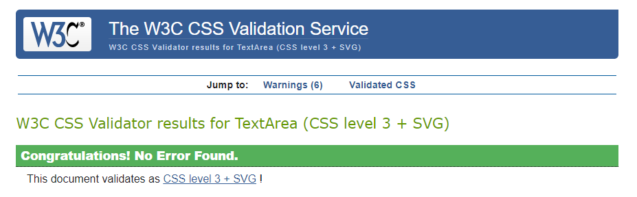

<h1 align="center">The Meadow Project-Testing</h1>

[View the live website here - The Meadow Project]()

---
<h2>Contents</h2>

# Introduction

Testing is essential to ensure the website functions correctly, is free from bugs, and allows users to fully utilise all features before its release to the general market. This guarantees a positive user experience (UX) and encourages repeat visits from customers and registered users.

Throughout the development process, I relied on Chrome developer tools to assess page responsiveness across various screen sizes and address any encountered issues. In troubleshooting, I utilised the console to log and monitor JavaScript code, aiding in resolving aspects of the site that did not perform as intended. Additionally, I employed Python development techniques to address backend issues, ensuring seamless functionality across the site. All the test results detailed below are based on the [deployed site]().

---

# Automated Testing

The automated testing implemented in this project complements the manual tests, ensuring that the Python code fulfilled its objectives from the outset. The testing strategy was not aimed at achieving 100% coverage but at supporting and enhancing the manual testing process. To run tests I have used the Django Testing Framework. 

The tests for each app can be found with test_veiws, tests_modals and tests_forms used where applicable. Note that tests were conducted using the local database, as Heroku does not support automatic testing of its databases. During testing, the Postgres database configuration in settings.py was commented out to facilitate running tests locally.

To run the tests:

* Type "python3 manage.py test" into the terminal.
* To test one app only type "python manage.py test <app name>".
* To understand how comprehensive the test are, coverage was installed using pip3, and then the following command was run "coverage run --source=the_meadow_project manage.py test"

* To view the coverage report type coverage report

## Validators

### HTML Validation

[W3C](https://validator.w3.org/) was used to validate the HTML using the URI for each page. Base.html was checked by extenstion on all pages but was also validated by a direct input check. There are also displayed errors due to Jinga templating such as: missing head elements, bad values, illegal characters/text not allowed, incorrect error for '==' missing lang attributes, an ID must not contain whitespace and element must be the ID of a non-hidden form control. However, these are and are not true errors. For an ID must not contain whitespace and element must be the ID of a non-hidden form control all were confirmed using for example (within p tags) ID for label: {{ form.image.id_for_label }}

Note Jinga templating errors within table and ul cause a 'Fatal Error' therefore the html has been checked in sections where this is the case. 

Specific "errors" in addition to the points above are listed in the table below. These have all been kept for functional purposes as removal of the element would result in the code not running as inteded. 

HTML Validation Table

| **Page**                  | **Result**                                                                                   | **Any errors remaining**                                                                  | **Explantation**                                                                                                                                                                                               |
|---------------------------|----------------------------------------------------------------------------------------------|-------------------------------------------------------------------------------------------|----------------------------------------------------------------------------------------------------------------------------------------------------------------------------------------------------------------|
| about.html                | Pass- but 2 'errors' remain                                                                  | 1. No p element in scope but a p end tag seen.  2.End tag a violates nesting rules.       | 1. Formatted script and checked that the opening p does exist. 2.required to ensreut the bold 'Events' text directs users to the shop page and that they can still click the entire area to be redirected too. |
| bag.html                  | Pass- but 1 'error' remains                                                                  |  Bad value for attribute action on element form: Must be non-empty.                       | This is for the quantiy update and the form must be subited to the same URL therfore error ignored.                                                                                                            |
| posts.html                | Pass- but 1 'error' remains                                                                  | End tag a violates nesting rules. 2.No strong element in scope but a strong end tag seen. | equired to ensreut the bold 'Sing up' text directs users correcty.                                                                                                                                             |
| add_post.html             | Pass                                                                                         |                                                                                           |                                                                                                                                                                                                                |
| post_delete.html          | Pass                                                                                         |                                                                                           |                                                                                                                                                                                                                |
| post_detail.html          | Pass                                                                                         |                                                                                           |                                                                                                                                                                                                                |
| post_update               | Pass                                                                                         |                                                                                           |                                                                                                                                                                                                                |
| checkout.html             | Pass- but 1 'error' remains                                                                  | Duplicate ID delivery_method_wrapper and event-form                                       | This is due to the different rendering of divs depending on if a product or product and event or event only. The two I'd do not exist on a page at any one time.                                               |
| checkout_success.html     | Pass                                                                                         |                                                                                           |                                                                                                                                                                                                                |
| contact.html              | Pass                                                                                         |                                                                                           |                                                                                                                                                                                                                |
| index.html                | Pass                                                                                         |                                                                                           |                                                                                                                                                                                                                |
| add_event.html            | Pass                                                                                         |                                                                                           |                                                                                                                                                                                                                |
| add_product_variant.html  | Pass                                                                                         |                                                                                           |                                                                                                                                                                                                                |
| add_product.html          | Pass                                                                                         |                                                                                           |                                                                                                                                                                                                                |
| edit_event.html           | Pass                                                                                         |                                                                                           |                                                                                                                                                                                                                |
| edit_product_variant.html | Pass                                                                                         |                                                                                           |                                                                                                                                                                                                                |
| edit_prodcut.html         | Pass                                                                                         |                                                                                           |                                                                                                                                                                                                                |
| event_detail.html         | Pass                                                                                         |  No p element in scope but a p end tag seen.                                              | 1. Formatted script and checked that the opening p does exist.                                                                                                                                                 |
| product_detail.hmtml      | Pass                                                                                         |                                                                                           |                                                                                                                                                                                                                |
| profile.html              | Pass                                                                                         |                                                                                           |                                                                                                                                                                                                                |
| reviews.html              | Pass                                                                                         |                                                                                           |                                                                                                                                                                                                                |
| review_order.html         | Pass                                                                                         |                                                                                           |                                                                                                                                                                                                                |
| shop.html                 | Pass- but 1 'error' remains + multiple Jinja tamplating errors for the filter/sort functions | Duplicate ID combined_items.                                                              | This is due to the presence of if/else statements. The Id's are not rendered together.                                                                                                                         |
| 403.html                  | Pass                                                                                         |                                                                                           |                                                                                                                                                                                                                |
| 404.html                  | Pass                                                                                         |                                                                                           |                                                                                                                                                                                                                |
| 500.html                  | Pass                                                                                         |                                                                                           |                                                                                                                                                                                                                |
| base.html                 | Pass- but 1 'error' remains + multiple Jinja tamplating errors for the filter/sort functions | Stray doctype and stray start tag                                                         | These have been checked aginast walkthough project and structure is correct.                                                                                                                                   |
| navbar.html               | Pass                                                                                         |                                                                                           |                                                                                                                                                                                                                |
| toast_error.html          | Pass                                                                                         |                                                                                           |                                                                                                                                                                                                                |
| toast_info.html           | Pass                                                                                         |                                                                                           |                                                                                                                                                                                                                |
| toast_success.html        | Pass                                                                                         |                                                                                           |                                                                                                                                                                                                                |

### CSS Validation

CSS was validated using [W3C Jigsaw](https://jigsaw.w3.org/css-validator/).

Css Validation for Static CSS

The same result was acheived for the checkout.css and profile.css

### Javascript Validation

The JavaScript code was validated using [JSHint](https://jshint.com/). 

Please note, warnings relate the use of ES6/8 and are acceptable for the parameters of this project.

Javascript Validation Table

| **Page**                             | **Result**       | **Explantation**                                                                                                                                                |
|--------------------------------------|------------------|-----------------------------------------------------------------------------------------------------------------------------------------------------------------|
| about.html                           | Pass - no errors |                                                                                                                                                                 |
| edit_items_script.html               | Pass - no errors |                                                                                                                                                                 |
| quantiy_input_script.html (bag)      | Pass - 1 error   | Due to J shint not recognising that the '$' which comes from JSON would have been loaded in the base.html                                                       |
| post_update.html                     | Pass - 1 error   | Due to J shint not recognising that the '$' which comes from JSON would have been loaded in the base.html                                                       |
| checkout_js_script.html              | Pass             |                                                                                                                                                                 |
| strip_elements_script.html           | Pass - 1 error   | OrderTupe is already defined - this is redefined due to changes from being a product/event that can occur in the script.                                        |
| quantiy_input_script (products).html | Pass - 1 error   | Due to J shint not recognising that the '$' which comes from JSON would have been loaded in the base.html                                                       |
| size_selection_script.html           | Pass             |                                                                                                                                                                 |
| whitespace_validation.html           | Pass             |                                                                                                                                                                 |
| edit_event.html                      | Pass - 1 error   | Due to J shint not recognising that the '$' which comes from JSON would have been loaded in the base.html                                                       |
| edit_product.html                    | Pass - 1 error   | Due to J shint not recognising that the '$' which comes from JSON would have been loaded in the base.html                                                       |
| review_order.html                    | Pass             |                                                                                                                                                                 |
| shop.html                            | Pass - 1 error   | Due to J shint not recognising that the '$' which comes from JSON would have been loaded in the base.html                                                       |
| base.html                            | Pass- 2 errors   | 1. Due to J shint not recognising that the '$' which comes from JSON would have been loaded in the base.html 2. Comes from code taken from bootstrap for toasts |

### Python Validation

Python pep8 validation was done via [Code Institute's Python Linter](https://pep8ci.herokuapp.com)

All the Python files were tested with changes made to make the code PEP8 compliant where possible.

### Performance (Lighthouse)

### Accessibility

# Manual Testing

The desktop version of the site underwent testing across various browsers and devices to ensure compatibility. Testing included Google Chrome, Mozilla Firefox, and Microsoft Edge on desktop computers. Additionally, Chrome was tested on both Lenovo Tablet and Pixel devices, while Safari was used for mobile testing.

The site was responsive on all browsers and devices (down to  320px as recommended by [Free Code Camp](https://www.freecodecamp.org/news/media-query-css-example-max-and-min-screen-width-for-mobile-responsive-design/))

## Testing User Stories

The site was built from the User Stories documented in the [Readme](README.md#user-stories). The site was tested against each of them and the results are documented below.

1. As a **potential customer**, I want to be able to:

* Immediately understand the purpose of the site and get a sense of its ethos.
    * The site opens with a stunning logo image of vibrant flowers, immediately drawing the user's attention. This is followed by a visually engaging image summary highlighting the main features of the shop. The presence of the navigation bar helps the user understand what the site offers from the very start. The home page gives a summary of the site and its ethos both using words and pictures. 

* Navigate to areas of interest quickly and easily.
    * The clear and intuitive navigation bar at the top of the page allows users to effortlessly explore the different sections of the site. 

* Filter what products I'm looking for.
    * Users can search the shop from the nav bar and can filter products by category on the main shop page.

* Visit the site on all my devices.
    * the site is responsive on all devices and has been designed to work on various screen sizes. 

* Find and understand key information about products including descriptions, costs, and delivery information so I can make an informed purchasing decision.
    * The main shop page clearly lists each product and event by name, along with their prices. Detailed information is available on individual product and event pages, including clear delivery details. Additional information about the site can be found on the About page.

* Understand what the company stands for and see it aligns with my values.
    * Users can navigate to the about page to understnad more about The Meadow Project and learn how they work. This will inform users if the site aligns with their values.

* Pick a delivery date that suits me.
    * Users can pick a delivery/pick up date that is convinent for them. 

* Add a message with my bouquet/plant delivery
    * Users can submit an order with a card message.

* Add a note to my order to say to avoid roses, or yellow flowers.
    * Users can submit an order with a note to the seller.

* Learn about future events I might want to sign up for.
    * Users can browse events in the shop by filtering by the events category. Future events are listed to encourage users to learn more about them and sign up. 

* View where the company is based so I can see if event attendance is possible.
    *  Users can see the contact/address information for The Meadow Project in the footer. They can also see this on the contact page, where a map is rendered to enhance UX. The about page gives more information about the event venue. This information is clearly linked from the event detail pages making it easy for a user to find. 

* Read reviews from other customers to help me make an informed purchasing decision.
    * Reveiws can be left by users with an account for each order. These are rendered to the home page. 

* Sign up for the site's newsletter so I can be informed about new events, products, and rewards.
    * Users are encouraged to sign up for the site at various points, including in the footer, during the checkout process to store their address information, and on the blog page, which offers a link to sign up and be the first to hear about new blog posts.

* Contact the business to ask any questions before making a purchase.
    * Users can use the contact information given in the footer, or can use the contact form on the contact page to get in touch with The Meadow Project. 

* Add products to my basket, so I can make a purchase when I'm ready to and have confidence they have been added succesfully.
    * Products can be easily added to a user's basket directly from their detail pages. The session is stored, making it even more convenient for users, as they can return to the site later and still see their basket with items saved. This allows them to continue browsing the shop and complete their transaction whenever they're ready.

* View my basket and identify how much my order might cost me.
    * Users can access their basekt from the Bag Icon in the navigation bar, allowing them to easily see their items at any time. A toast informs the user of this information when they add a item to their basket. 

* See adverts for part of the site I might not have thought of.
    * This has not been implemented at this time but is flagged as a future development. 

* Follow the companies social media platforms. 
    * Social media links are given in the footer. 

As a **buying customer** , I would also like to be able to:

* Easily input my delivery and card information.
    * The checkout form allows a user to easily input this information.

* Register on the site so I can make further purchases more easily.
    * Users are encouraged to sign up for the site at various points, including in the footer, during the checkout process to store their address information, and on the blog page, which offers a link to sign up and be the first to hear about new blog posts.

* Remove unwanted items from my basket. 
    * Items can be easily removed from the basket by clicking the bin icon next to each product. The ability to adjust the bag is also available from the checkout page giving the user convient ways to ammend their order if they need to. 

* Be able to add more than one person to an event's booking.
    * Users input the attendee names into their booking therefore they can purchace two tickets at once. 

* Recieve an email confirmation of my order once complete.
    * An automatic email is sent to users once they have completed their order. Further to this, Event tickets are also automatically sent out if they have been purchaced. 

As a **registerd user**, I would also like to be able to:

* Sign into my account.
    * Users can sign into their account from the Profile Icon in the navigation bar.

* Find previous oders easily and see a summary.
    * The profile page renders a users order history with a summary of the items purchaced. They can see further details by clicking the order number.

* Contact the business about a specific order.
    * If a user is logged in, the contact form renders a drop down menu of previous orders, listing the number and the date to help the user idenfiy which order they want to contact the site about. This is submitted with the form.

* Update my details.
    * Name and address details can be updated from the profile page. 

* Change my password.
    * This is integrated using Django Allauth. Users can change their password if they need to using a link from the profile page.

* Reset my password if I forget it.
    * This is integrated using Django Allauth and can be accessed from the log in page. 

* Sign out of my account.
    * Users can sign out of their accounts using the drop down option from the Profile Icon in the navigation bar. 

* Add/Edit reviews to products to help others be informed about their purchasing decsions. 
    * At present a user can only add a reveiw to the site and not edit them. This was a purposful decision during the creation of the site. This is to ensure that reveiws don't get changed if a user decides to modify previous content. They can contact the site owners to remove any reveiws they no longer want listed. 

As a **business owner** user, I would like to be able to:

* Add, edit, and delete events on the site quickly and easily.
    * Only superusers can add events, which they can do from their profile page (the management page) or directly from the shop. Superusers also have the ability to edit or delete items, either from their individual detail pages or directly from the shop page via the item's card.

* View an event summary, including who is booked for each event.
    * An email is sent to owners when a user checks out an event. This lists the attendees. 

* Have immediate access to customer information, including those registered to receive our newsletter and discounts.
    * These features haven't been implemented at this time so a customer information interface has not been developed. This is noted as a future development.

* Amend the reward codes the site is accepting.
    * This feature hasn't been implemented at this time. 

* Edit and delete products and their prices.
    * Items can be edited using the form connected to each product. This can be accessed via the shop cards, or via the item detail page. Delete function is accessed from the same places. 

* Delete user reviews (if malicious).
    * Superusers have access to a table which lists all reveiws submitted to the site. They can use this to find and delete malicious reveiws. 

* Track sales data to see which products are most popular and help with stock control.
    * This feature hasn't been implemented at this time.

* Add a blog post to the site.
    * Superusers can add a blog post from the main blog page or using the button in their admin profile. Both buttons take them to the form which allows them to submit a post to the site. 

* Control stock.
     * This feature hasn't been implemented at this time.

* Receive emails from users who contact the business via the contact form(s)
    * The contact form on the site sends an email to The Meadow Project. This can be picked up by team members and easily resolved. 

## Real User Testing

## Functional Test Results

Navbar

| **Feature**                       | **Expected Outcome**                                                                                                 | **Test Performed**                               | **Result**                                                                                                           | **Pass/Fail** |
|-----------------------------------|----------------------------------------------------------------------------------------------------------------------|--------------------------------------------------|----------------------------------------------------------------------------------------------------------------------|---------------|
| Logo                              |  Navigates to the landing page when clicked                                                                          | Clicked logo                                     | Taken to the landing page                                                                                            | Pass          |
| Home text                         |  Navigates to the landing page when clicked                                                                          | Clicked home text                                | Taken to the landing page                                                                                            | Pass          |
| Shop text                         |  Navigates to the shop when clicked                                                                                  | Clicked shop text                                | Taken to the shop page                                                                                               | Pass          |
| Blog Posts text                   |  Navigates to the blog posts page when clicked                                                                       | Clicked blog posts text                          | Taken to the blog posts page                                                                                         | Pass          |
| About text                        |  Navigates to the about page when clicked                                                                            | Clicked about text                               | Taken to the about page                                                                                              | Pass          |
| Contact text                      |  Navigates to the contact page when clicked                                                                          | Clicked contact text                             | Taken to the contact page                                                                                            | Pass          |
| User Icon                         | Opens a menu of user-related options                                                                                 | Clicked user icon                                | Menu opens                                                                                                           | Pass          |
| Menu options                      | Content renders and functions correctly depeding of if the user is logged in/out and whether the user is a superuser | Logged in and out as different users             | Content renders and functions correctly depeding of if the user is logged in/out and whether the user is a superuser | Pass          |
| Bag icon                          | Navigates the user to their basket                                                                                   | Clicked on the bag icon                          | Taken to the basket (bag) page                                                                                       | Pass          |
| Magnifyibng glass icon            | Opens up the shop search bar                                                                                         | Clicked on the icon                              | Shop searchbox opens                                                                                                 | Pass          |
| Shop search box and Search button | Text is searched in the shop for relavent items                                                                      | Typed a search in the box and clicked the button | Redirected to the shop page with search text rendered and relavent items only displayed in the shop                  | Pass          |
| Shop seach 'X' button             | Closes the search                                                                                                    | Clicked the button                               | Search bar is closed                                                                                                 | Pass          |
| Navbar active class               | Applied to the relavent pages for each section of the site                                                           | Navigated around the site                        |  Correct section was highlighted and 'active'                                                                        | Pass          |

Footer

| **Feature**                               | **Expected Outcome**                                              | **Test Performed**               | **Result**                                       | **Pass/Fail** |
|-------------------------------------------|-------------------------------------------------------------------|----------------------------------|--------------------------------------------------|---------------|
| Logo                                      |  Navigates to the landing page when clicked                       | Clicked logo                     | Taken to the landing page                        | Pass          |
| Informative text                          | content changes depending on if a user is logged in or not        | Logged in and out                | Content renders correctly                        | Pass          |
| logged in 'youre already signed in text'  |  Navigates to the landing page when clicked                       | Clicked the text                 | Taken to the landing page                        | Pass          |
| logged out 'sign up here'                 | Navigates the user to the sign up page                            | Clicked the text                 | Taken to the sign up page                        | Passs         |
| Email address text                        | Opens a new tab with the contact page open when clicked           | Clicked email text               | New tabe opens to the contact page               | Pass          |
| Social Media icons                        | Opens a new tab to the respective social media sites when clicked | Clicked each social media button | Opens a new tab to the correct social media site | Pass          |

Error Pages

| **Feature**              | **User** | **Expected Outcome**                     | **Test Performed**         | **Result**                     | **Pass/Fail** |
|--------------------------|----------|------------------------------------------|----------------------------|--------------------------------|---------------|
| 403 error go home button | All      | Navigates the user back to the home page | Clicked the go home button | Redirected to the landing page | Pass          |
| 404 error go home button | All      | Navigates the user back to the home page | Clicked the go home button | Redirected to the landing page | Pass          |
| 500 error go home button | All      | Navigates the user back to the home page | Clicked the go home button | Redirected to the landing page | Pass          |

Toasts

| **Feature**   | **User** | **Expected Outcome**                          | **Test Performed**                             | **Result**              | **Pass/Fail** |
|---------------|----------|-----------------------------------------------|------------------------------------------------|-------------------------|---------------|
| Success toast | All      | Displayed when triggered with correct content | Undertook actions which rendered Success toast | Success toast displayed | Pass          |
| Info toast    | All      | Displayed when triggered with correct content | Undertook actions which rendered info toast    | Info toast displayed    | Pass          |
| Error toast   | All      | Displayed when triggered with correct content | Undertook actions which rendered error toast   | Error toast displayed   | Pass          |

Bag App

| **Feature**                                | **Expected Outcome**                                                                                             | **Test Performed**                                       | **Result**                                         | **Pass/Fail** |
|--------------------------------------------|------------------------------------------------------------------------------------------------------------------|----------------------------------------------------------|----------------------------------------------------|---------------|
| Basket counter                             | Updates according to how many items are in the basket                                                            | Changed the number of items in the basket (+ and -)      | Total number in the () updated correctly           | Pass          |
| Delete button                              | Triggers a confirmation box to confirm the delete action                                                         | Clicked the delete button                                | Confirmation box is triggered                      | Pass          |
| Delete button - OK                         | Deletes all instances of one product/event and triggers info toast                                               | Clicked the ok button                                    | Item deleted from basket and info toast displayed  | Pass          |
| Delete button - Cancel                     | Returns the user to the basket with no changes                                                                   | Clicked on the cancel button                             | Returned to the basket view                        | Pass          |
| Quantity (product) update box and text     | Updates the number of the item in the basket. Sub total updates and info toast triggered                         | Typed a number and clicked on the built in arrow buttons | Quanty and subtotal updated. Info toast displayed  | Pass          |
| Card message edit button                   | Opens a text box to allow the user to edit their card message                                                    | Clicked on the pen icon (button)                         | Opened up the text box                             | Pass          |
| Card message text box and update button    | New text is saved to the item(s) in the basket and info toast triggered                                          | Typed in the box and clicked update                      | The text was saved and the info toast displayed    | Pass          |
| Note (product) edit button                 | Opens a text box to allow the user to edit their note                                                            | Clicked on the pen icon (button)                         | Opened up the text box                             | Pass          |
| Note  (product) text box and update button | New text is saved to the item(s) in the basket and info toast triggered                                          | Typed in the box and clicked update                      | The text was saved and the info toast displayed    | Pass          |
| Note (event) edit button                   | Opens a text box to allow the user to edit their note                                                            | Clicked on the pen icon (button)                         | Opened up the text box                             | Pass          |
| Note  (event)  text box and update button  | New text is saved to the item(s) in the basket and info toast triggered                                          | Typed in the box and clicked update                      | The text was saved and the info toast displayed    | Pass          |
| Button hover                               | All buttons should change colour when hovered over                                                               | Hovered over all buttons                                 | Buttons changed colour                             | Pass          |
| Delivery Information button                | Triggers a drop down of content displaying the delivery information for the site. Clicking again closes the card | Clicked the button                                       | Delivery information content displayed/hidden      | Pass          |
| Checkout button                            | Navigates the user to the checkout page                                                                          | Clicked the button                                       | Redirected to the checkout page                    | Pass          |
| Shop button                                | Navigates the user to the shop page                                                                              | Clicked the button                                       | Redirected to the shop page                        | Pass          |
| All buttons hover effect                   | Buttons change colour when they are hovered over                                                                 | Hovered over all buttons                                 | Colour chages                                      | Pass          |

Blog App

| **Feature**                                | **User**        | **Expected Outcome**                                                                                            | **Test Performed**                                                      | **Result**                                                                          | **Pass/Fail** |
|--------------------------------------------|-----------------|-----------------------------------------------------------------------------------------------------------------|-------------------------------------------------------------------------|-------------------------------------------------------------------------------------|---------------|
| **Post detail Page**                          |                 |                                                                                                                 |                                                                         |                                                                                     |               |
| Edit text                                  | Superuser       | Takes the superuser to the edit post page                                                                       | Clicked on the edit text                                                | Taken to the edit post page                                                         | Pass          |
| Delete text                                | Superuser       | Brings upt the confirm deletion page for the blog post                                                          | Clicked on the delete text                                              | Taken to the confrim deletion page                                                  | Pass          |
| Back to posts button                       | All             | Takes the user back to the all blog posts page                                                                  | Clicked the button                                                      | Taken back to the all blog posts page                                               | Pass          |
|                                            |                 |                                                                                                                 |                                                                         |                                                                                     |               |
| **Add post page**                              |                 |                                                                                                                 |                                                                         |                                                                                     |               |
| Post button                                | Superuser       | Send form to backend and saves post in the database, takes user to post detail page with a success (info) toast | Inputed all details into the form and clicked post                      | Taken to the post's detail page and given a success (info) toast                    | Pass          |
| Edit post drop down (Product and Event)    | Superuser       | Loads all products/events listed on the site (even inactive ones)                                               | Clicked on the drop down box                                            | Shows product/events for selection                                                  | Pass          |
| Form validation                            | Superuser       | All required fields prevent user submitting post if they are left blank                                         | Left each input blank individually                                      | Form does not submit                                                                | Pass          |
|                                            |                 |                                                                                                                 |                                                                         |                                                                                     |               |
| **Delete page**                                |                 |                                                                                                                 |                                                                         |                                                                                     |               |
| Yes delete button                          | Superuser       | Deletes the blog post and gives success info toast                                                              | Clicked on the button                                                   | Post is deleted and gives success info toast                                        | Pass          |
| No Go back button                          | Superuser       | Goes back to the prev page the user was on (blog post or all blog posts)                                        | Clicked the button                                                      | Returned to prev page                                                               | Pass          |
|                                            |                 |                                                                                                                 |                                                                         |                                                                                     |               |
| **All posts page**                             |                 |                                                                                                                 |                                                                         |                                                                                     |               |
| Edit text                                  | Superuser       | Takes the superuser to the edit post page                                                                       | Clicked on the edit text                                                | Taken to the edit post page                                                         | Pass          |
| Delete text                                | Superuser       | Brings upt the confirm deletion page for the blog post                                                          | Clicked on the delete text                                              | Taken to the confrim deletion page                                                  | Pass          |
| Blog post search                           | All             | Typing in the box allows users to search the blog posts for specific subjects                                   | Typed in the box and clicked search                                     | Relavent blog posts returned to the user                                            | Pass          |
| Search post clear button                   | All             | Clears the search results and renders all blog posts again                                                      | After a search, clicked the clear button                                | Search resutls cleared and all blog posts rendered agaion                           | Pass          |
| No resutls information                     | All             | If a search results yeilds no blogs, text is rendered to tell the user                                          | Typed a search with no results 'banabe'                                 | Text renders to template stating 'No results found for 'banabe'                     | Pass          |
| Pagination                                 | All             | The bottom of the page shows how many pages of blog posts there are on the page.                                | Viewed the pagination information with all results and searched results | Pagination information changes depeding on how many results there are               | Pass          |
| Pagination navigation                      | All             | Clicking on the page number or the arrows allows the user to move through the different pages                   | Clicked on the numbers/arrows                                           | Move through the blog pages                                                         | Pass          |
| Blog Posts sign up text (logged out users) | logged out user | If a user is logged out, the 'Sign up' text in the openeing paragraph directs the user to the sign up page      | Clicked on the sign up text as a logged out user                        | Directed to the sign up page                                                        | Pass          |
| Blog post image and 'Read more' text       | All             | Takes the user to the specific blog post                                                                        | Clicked on the image and the read more text                             | Taken to the specific blog post                                                     | Pass          |
| Add post button                            | Superuser       | Takes the superuser to the add post page                                                                        | Clicked the button                                                      | Taken to the add post page                                                          | Pass          |
|                                            |                 |                                                                                                                 |                                                                         |                                                                                     |               |
| **Edit  Post Page**                            |                 |                                                                                                                 |                                                                         |                                                                                     |               |
| Edit post page                             | Superuser       | Renders with correct post information already in the form                                                       | Checked the edit post page                                              | Page renders blog post information                                                  | Pass          |
| Edit post drop down (Product and Event)    | Superuser       | Loads all products/events listed on the site (even inactive ones)                                               | Clicked on the drop down box                                            | Shows product/events for selection                                                  | Pass          |
| Edit post Select a new image button        | Superuser       | Allows the user to select a new image and informs them the name of their new choice                             | Clicked the button                                                      | Able to select a new image. Once selected text informs the user of their choice.    | Pass          |
| Edit post Cancel Button                    | Superuser       | Takes the user back to the specific blog post detail page                                                       | Clicked the button                                                      | Taken to the specific blog post detail page                                         | Pass          |
| Edit post Save Button                      | Superuser       | Updates the blog post and renders a success message to the user on the posts detail page                        | Clicked the button                                                      | Post is updated and taken to the blog post detail page with a success (info) toast. | Pass          |

Checkout App

| **Feature**                                            | **Expected Outcome**                                                                                                    | **Test Performed**                                                                                             | **Result**                                                                                                   | **Pass/Fail** |
|--------------------------------------------------------|-------------------------------------------------------------------------------------------------------------------------|----------------------------------------------------------------------------------------------------------------|--------------------------------------------------------------------------------------------------------------|---------------|
| **Order Summary**                                         |                                                                                                                         |                                                                                                                |                                                                                                              |               |
| Order Summary counter                                  | Updates according to how many items are in the basket                                                                   | Changed the number of items in the basket                                                                      | Total number in the () updated correctly                                                                     | Pass          |
| Adjust Bag button                                      | Returns the user to their basket                                                                                        | Clicked the text                                                                                               | Returned the user to their basket                                                                            | Pass          |
| Order Summary size                                     | Correct text displayed                                                                                                  | Altered size                                                                                                   | Correct text displayed                                                                                       | Pass          |
| Order Summary quantity                                 | Correct text displayed and subtotal updated                                                                             | Altered quantity                                                                                               | Correct text displayed and subtotal updated                                                                  | Pass          |
| Order Summary card message                             | Correct text displayed                                                                                                  | Altered  card message                                                                                          | Correct text displayed (Y/N)                                                                                 | Pass          |
| Order Summary note (p)                                 | Correct text displayed                                                                                                  | Altered  note                                                                                                  | Correct text displayed (Y/N)                                                                                 | Pass          |
| Order Summary attendee                                 | Correct text displayed                                                                                                  | Altered  attendee information                                                                                  | Correct text displayed                                                                                       | Pass          |
| Order Summary note (e)                                 | Correct text displayed                                                                                                  | Altered  note                                                                                                  | Correct text displayed (Y/N)                                                                                 | Pass          |
| Order total, delivery and grand total                  | Up date accoding to basket information                                                                                  | changed quantiy of items to render different results                                                           | Correct amounts displayed                                                                                    | Pass          |
| **Checkout**                                               |                                                                                                                         |                                                                                                                |                                                                                                              |               |
| Name and email address input fields                    | Name and email address correctly stored in order and error if incomplete                                                | Submitted the form with these values. Attempted to click next with either input empty or invalid email address | Inputs correctly saved in the form. Alerts if either are missing                                             | Pass          |
| Next button                                            | Moves the user to the next section                                                                                      | Clicked the next button                                                                                        | User moved to the next part of the form                                                                      |               |
| **Checkout part 2**                                       |                                                                                                                         |                                                                                                                |                                                                                                              |               |
| Input fields                                           | All fields are required (apart from street address 2) and stored in order. Alerts given if any inputs are missing       | Attempting to move to the next step with each part missing and all complete                                    | Inputs correctly saved in the form. Alerts if any are missing                                                | Pass          |
| Next button                                            | Moves the user to the next section                                                                                      | Clicked the next button                                                                                        | User moved to the next part of the form                                                                      | Pass          |
| Previous button                                        | Moves the user to the previous part of the form                                                                         | Clicked the previous button                                                                                    | User moved to the previous part of the form                                                                  | Pass          |
| Product ONLY delivery check box                        | Box rendered if basket contains a product, renders address information into delivery form in the next section           | Added products, products and events and just events to bag. Clicked box when present.                          | Delivery form filled in correctly and box only rendered when there was a product in the basket               | Pass          |
| Save information to profile checkbox (Logged in users) | Saves information from this part of the form to the users profile (if they are logged in)                               | Ticked the box, processed an order then checked the profile for the same information                           | Customer information saved to the profile                                                                    | Pass          |
| Create account/login options                           | Should be presented to users who aren't logged in,                                                                      | Checked out as a non logged in user                                                                            | Saw and could access the create account/login pages without losing my basket                                 | Pass          |
| Create account/login links                             | Take the user to the correct page                                                                                       | Clicked each text                                                                                              | Taken to the correct page                                                                                    | Pass          |
| **Checkout part 3**                                      |                                                                                                                         |                                                                                                                |                                                                                                              |               |
| Delivery/date collection input                         | User can select a date. This must be in the future and not on a Sunday for delivery or Sunday/Monday for pickup         | Selected different dates                                                                                       | Correct inputs allowed the form to progress. Invalid dates gave a alert.                                     | Pass          |
| Delivery radio button                                  | loads the form for delivery information                                                                                 | Clicked the radio button                                                                                       | Delivery form loaded                                                                                         | Pass          |
| Delivery address input fields                          | All fields are required (apart from street address 2) and stored in order. Alerts given if any inputs are missing       | Attempting to move to the next step with each part missing and all complete                                    | Inputs correctly saved in the form. Alerts if any are missing                                                | Pass          |
| Delivery information loaded automatically              | If the user has selected to use the same delivery details as billing (checkbox), these fields are automatically filled  | Checked and unchecked the box in checkout part 2                                                               | Delivery form loaded correctly with/without data.                                                            | Pass          |
| Shop pick up radio button                              | loads the shop information (and does not load the delivery information)                                                 | Clicked the radio button                                                                                       | Shop info loaded                                                                                             | Pass          |
| Postcode field                                         | Only allows valid postcodes allowed and notifies user if it doesn't match.                                              | inputed a postcode other than BS1 to BS6.                                                                      | Alert given.                                                                                                 | Pass          |
| Next button                                            | Moves the user to the next section                                                                                      | Clicked the next button                                                                                        | User moved to the next part of the form                                                                      | Pass          |
| Previous button                                        | Moves the user to the previous part of the form                                                                         | Clicked the previous button                                                                                    | User moved to the previous part of the form                                                                  | Pass          |
| **Checkout part 4**                                        |                                                                                                                         |                                                                                                                |                                                                                                              |               |
| Card number validation                                 | Invalid card numbers render a warning message and prevent the form from being submitted                                 | Typed an invalid card number and tried to sumbit the form                                                      | Submission prevented and red information text rendered to the user                                           | Pass          |
| Card date validation                                   | Invalid card dates render a warning message and prevent the form from being submitted                                   | Typed an invalid date and tried to sumbit the form                                                             | Submission prevented and red information text rendered to the user                                           | Pass          |
| Previous button                                        | Moves the user to the previous part of the form                                                                         | Clicked the previous button                                                                                    | User moved to the previous part of the form                                                                  | Pass          |
| Complete order button                                  | Submits the order and processes the payment                                                                             | Clicked the complete order button                                                                              | User redirected to the 'Thank you' page. Order and payment confirmed in webhooks and in Django Admin panel.  | Pass          |
| Adjust Bag button                                      | Returns the user to their basket                                                                                        | Clicked the Adjust Bag button                                                                                  | Returned the user to their basket                                                                            | Pass          |
| **Checkout success**                                       |                                                                                                                         |                                                                                                                |                                                                                                              |               |
| Checkout success page                                  | Rendered with the correct information relating the users billing/delivery and order details                             | Submitted muliple orders of varying quantity and type                                                          | Correct information rendered to the template                                                                 | Pass          |
| Back to shop button                                    | Returns the user to the shop                                                                                            | Clicked the back to shop button                                                                                | returned to the shop page                                                                                    | Pass          |
| Back to profile button                                 | Returns user to the profile if they are looking at this form as a prev order                                            | Clicked the back to profile button                                                                             | Returned to the profile page                                                                                 | Pass          |
| Automatic email - Customer                             | Customer recieves an email following successful checkout with correct information (body) and subject header             | Checkout out and checked relavent email account                                                                | Email received                                                                                               | Pass          |
| Automatic email - Customer Event ticket                | Event ticket emails sent to users who buy an event. Correct information in the body and subject header                  | Checkout out with an event and checked relavent email account                                                  | Email received                                                                                               | Pass          |
| Automatic email - Admin                                | Admin account recieves an email will all order information                                                              | Checkout out and checked the admin email account                                                               | Email received                                                                                               | Pass          |
| All buttons hover effect                               | Buttons change colour when they are hovered over                                                                        | Hovered over all buttons                                                                                       | Colour chages                                                                                                | Pass          |

Home App

| **Feature**             | **User** | **Expected Outcome**                                         | **Test Performed** | **Result**                                              | **Pass/Fail** |
|-------------------------|----------|--------------------------------------------------------------|--------------------|---------------------------------------------------------|---------------|
| Flowers button          | All      | Takes user to the shop with the category flowers preselected | Clicked the button | Taken to the shop with the category flowers preselected | Pass          |
| Plants button           | All      | Takes user to the shop with the category plants preselected  | Clicked the button | Taken to the shop with the category plants preselected  | Pass          |
| Events button           | All      | Takes user to the shop with the category events  preselected | Clicked the button | Taken to the shop with the category events  preselected | Pass          |
| Pictures of flowers (2) | All      | Takes user to the shop with the category flowers preselected | Clicked the images | Taken to the shop with the category flowers preselected | Pass          |
| Pictures of plants (2)  | All      | Takes user to the shop with the category plants preselected  | Clicked the images | Taken to the shop with the category plants preselected  | Pass          |
| Picture of bike         | All      | Takes user to the Delviery part of the about page            | Clicked the images | Taken to the delivery part of the about page            | Pass          |
| Learn more button       | All      | Takes user to the about page                                 | Clicked the button | Taken to the about page                                 | Pass          |
| Shop button             | All      | Takes the user to the shop page                              | Clicked the button | Taken user to the shop page                             | Pass          |
| Events button (2)       | All      | Takes user to the shop with the category events  preselected | Clicked the button | Taken to the shop with the category events  preselected | Pass          |
| Hover on all buttons    | All      | Changes colour of button                                     | hovered on button  | Colour changed                                          | Pass          |

Products App

| **Feature**                                                              | **Expected Outcome**                                                                                                                                                   | **Test Performed**                                                                         | **Result**                                                                                                                | **Pass/Fail** |
|--------------------------------------------------------------------------|------------------------------------------------------------------------------------------------------------------------------------------------------------------------|--------------------------------------------------------------------------------------------|---------------------------------------------------------------------------------------------------------------------------|---------------|
| **All **Users**                                                                |                                                                                                                                                                        |                                                                                            |                                                                                                                           |               |
| Products delivery information button                                     | Opens the delivery information section                                                                                                                                 | Clicked the button                                                                         | Opens the delivery information section                                                                                    | Pass          |
| Products availiable sizes selection                                      | Renders product variants which have been added and allow the user to select them                                                                                       | Loaded different product variants and clicked the sizes selection box                      | Renders product variants which have been added and allow the user to select them                                          | Pass          |
| Products price box                                                       | Correctly displays to the user the price of the variant selected                                                                                                       | Clicked different variants from the size selection box                                     | Price updates                                                                                                             | Pass          |
| Quantity selection (products)                                            | User can type a number in the box or use +/- to change the quantiy of the item they are adding                                                                         | Typed number into the box and used the +/- to change the number before submitting the form | Correct quantiy submitted                                                                                                 | Pass          |
| Products out of stock notification                                       | If an item is not marked 'is_active' or if there are no prodcut variants the user is informed 'the item is out of stock'                                               | removed all variants and separatly marked an item as inactive                              | Test renders ' we are sorry this item is out of stock'                                                                    | Pass          |
| Products  price for not 'is_active' items or no product variants         | If an item is not marked 'is_active' or if there are no prodcut variants the price reads N/A                                                                           | removed all variants and separatly marked an item as inactive                              | Price reads N/a                                                                                                           | Pass          |
| Products size selection for not 'is_active' items or no product variants | If an item is not marked 'is_active' or if there are no prodcut variants the size selection reads, sorry this product is unavilable                                    | removed all variants and separatly marked an item as inactive                              | Size selection reads, sorry this product is unavailable                                                                   | Pass          |
| Events click here button                                                 | Takes the user to the About page to learn more about the events                                                                                                        | Clicked click here                                                                         | Taken to the events section of the about page.                                                                            | Pass          |
| Quantity selection (events)                                              | User can type a number in the box or use +/- to change the quantiy of the item they are adding                                                                         | Typed number into the box and used the +/- to change the number before submitting the form | Correct quantiy submitted                                                                                                 | Pass          |
| Events attendee name input                                               | Prevents the form from being submitted if it is left blank                                                                                                             | Tried to submit the form without any text in the inptu                                     | Alert given to add attendee info                                                                                          | Pass          |
| Add to basket buttons                                                    | Adds the product(s) or event(s) to the basket and notifies user                                                                                                        | Clicked the button                                                                         | Returned to a new product form and rendered a success toast                                                               | Pass          |
| Card messages and Notes are optional                                     | User should be able to submit the form without these parts filled in                                                                                                   | Left the inputs blank                                                                      | Form still submits                                                                                                        | Pass          |
| Success toast                                                            | When an item is added to the basket the success toast correctly renders the basket information                                                                         | Updated the basket several times                                                           | Success toast renders the correct information                                                                             | Pass          |
| Breadcrumbs                                                              | Correctly show the user where they are in the shop and navigate back to correct pages/rendered pages                                                                   | Observed on different pages and clicked different navigation points                        | Correctly show the user where they are in the shop and navigated back to correct pages/rendered pages                     | Pass          |
| All buttons hover effect                                                 | Buttons change colour when they are hovered over                                                                                                                       | Hovered over all buttons                                                                   | Colour chages                                                                                                             | Pass          |
| **Superusers**                                                               |                                                                                                                                                                        |                                                                                            |                                                                                                                           |               |
| Add product form and button                                              | Add product form allows the user to add a product to the database. Returns a info toast when added successfully.                                                       | Added  a product with all required input fields                                            | Product added the the database and renders in the shop (once variants are added)                                          | Pass          |
| Add product from cancel button                                           | Takes the user back to the shop                                                                                                                                        | Clicked the button                                                                         | Taken to the shop page                                                                                                    | Pass          |
| Add product form verification                                            | If a required field is missing, the user is taken to the missing part of the form or given a error message that the product didn't add and to ensure the form is valid | Tried to submit the form with missing inputs                                               | Form doesn't submit and the user is taken to the part missing/ given an error message                                     | Pass          |
| Add product variant form and save button                                 | Only allows one of each variant type to be added. If the item is a gift card the 'sizes' read as 'options'                                                             | Added individual variants and tried to repeat add each                                     | Variants are added. An error message notifies uses if they have already added that variant and the form does not submit.  | Pass          |
| Product variant cancel button                                            | Takes the user back to the product detail page                                                                                                                         | Clicked the button                                                                         | Taken to the product detail page                                                                                          | Pass          |
| Edit text on the product detail page                                     | Takes the user to the edit product form with details already rendered                                                                                                  | Clicked the edit text                                                                      | Taken to the edit product page                                                                                            | Pass          |
| Select a new image button (product)                                      | Allows the user to select a new image and informs them the name of their new choice                                                                                    | Clicked the button                                                                         | Able to select a new image. Once selected text informs the user of their choice.                                          | Pass          |
| Edit product save button                                                 | Saves the edit form and returns the user to the product detail page  with a info toast stating 'success'                                                               | Clicked the button                                                                         | Product is updated and user is returned to the product detail page  with a info toast stating 'success'                   | Pass          |
| Edit product cancel button                                               | Takes the user back to the product detail page                                                                                                                         | Clicked the button                                                                         | Taken to the product detail page                                                                                          | Pass          |
| Delete text on the product detail page                                   | Returns an alert asking the user to confirm they want to delete the product. Pressing ok deletes the product and all associated variants  and toast updates the user   | Clicked the text                                                                           | Alert rendered and pressing ok deletes the product and all variant  and toast updates the user                            | Pass          |
| Add variant button on the product detail page                            | Navigates to the add variant form                                                                                                                                      | Clicked the text                                                                           | Taken to the add variant form                                                                                             | Pass          |
| Edit text next to variants                                               | Navigates to the edit variant form                                                                                                                                     | Clicked the text                                                                           | Taken to the edit variant form                                                                                            | Pass          |
| Delete text next to variants                                             | Returns an alert asking the user to confirm they want to delete the varinant. Pressing ok deletes the product variant  and toast updates the user                      | Clicked the text                                                                           | Varaint deleted  and toast updates the user                                                                               | Pass          |
| Product, product variant and event price                                 | Must be at least £0.30 (min set by Stripe), if not an error message informs the user to check the form and red text notifies them that the price must be more than 0.3 | Tried to submit the form with lower value prices                                           | Form does not submit, error message given and red text renders                                                            | Pass          |
| Inactive information (products)                                          | If a product is marked as not 'is_active'  red text notifies the user that it has been set this way                                                                    | Changed a product from is_active to not                                                    | If a product is marked as not 'is_active'  red text notifies the user that it has been set this way                       | Pass          |
| Add event form and  button                                               | Add event form allows the user to add a event to the database. Returns a info toast when added successfully.                                                           | Added  a event with all required input fields                                              | Event added to the database and rendered in the shop                                                                      | Pass          |
| Add event form cancel button                                             | User is redirected to the shop page                                                                                                                                    | Clicked the button                                                                         | Redirected to the shop page                                                                                               | Pass          |
| Edit text on event detial page                                           | Takes the user to the edit event page                                                                                                                                  | Clicked the text                                                                           | Redirected to the edit event page                                                                                         | Pass          |
| Edit event save button                                                   | Saves the edit form and returns the user to the event detail page with a info toast stating 'success'                                                                  | Clicked the button                                                                         | Event is updated and user is returned to the product detail page  with a info toast stating 'success'                     | Pass          |
| Select a new image button (event)                                        | Allows the user to select a new image and informs them the name of their new choice                                                                                    | Clicked the button                                                                         | Able to select a new image. Once selected text informs the user of their choice.                                          | Pass          |
| Delete text on the event detail page                                     | Returns an alert asking the user to confirm they want to delete the event. Pressing ok deletes the event and toast updates the user                                    | Clicked the text                                                                           | Alert rendered and pressing ok deletes the event  and toast updates the user                                              | Pass          |

Profile App

| **Feature**                                        | **User**       | **Expected Outcome**                                                                                                                   | **Test Performed**                                 | **Result**                                                | **Pass/Fail** |
|----------------------------------------------------|----------------|----------------------------------------------------------------------------------------------------------------------------------------|----------------------------------------------------|-----------------------------------------------------------|---------------|
| View Reviews button                                | Logged in user | Navigates to the all reveiws page                                                                                                      | Clicked the buton                                  | Redirected to the view reviews page                       | Pass          |
| Address Information and update information button  | Logged in user | Any part of the form can be updated/inputed by filling in/editing the form and clicking the button. Success (info) toast notifies user | Added details into the form and clicked the button | Details updated/added. Success (info) toast notifies user | Pass          |
| Order Number                                       | Logged in user | Takes the user to the thank you page/summary with an added toast stating this is for a PAST order                                      | Clicked the order number                           | Taken to a previous order thankyou page/summary           | Pass          |
| Add product button                                 | Superuser      | Navigates to the add product page                                                                                                      | Clicked the buton                                  | Navigates to the add product page                         | Pass          |
| Add event button                                   | Superuser      | Navigates to the add event page                                                                                                        | Clicked the buton                                  | Navigates to the add event page                           | Pass          |
| Add blog post button                               | Superuser      | Navigates to the add blog post page                                                                                                    | Clicked the buton                                  | Navigates to the add blog post page                       | Pass          |
| Reactivate item button                             | Superuser      | Navigates to the shop page                                                                                                             | Clicked the buton                                  | Navigates to the shop page                                | Pass          |
| View reviews button                                | Superuser      | Navigates to the all reviws page                                                                                                       | Clicked the buton                                  | Navigates to the all reviws page                          | Pass          |
| Shop text link                                     | Superuser      | Navigates to the shop page                                                                                                             | Clicked the text                                   | Navigates to the shop page                                | Pass          |

                    

Review App

| **Feature**                                     | **Expected Outcome**                                                                                             | **Test Performed**                            | **Result**                                                  | **Pass/Fail** |
|-------------------------------------------------|------------------------------------------------------------------------------------------------------------------|-----------------------------------------------|-------------------------------------------------------------|---------------|
| Reviw order summary renders correct information | Order Summary should show details relating to each order                                                         | Clicked on different orders and checked items | Order summary shows correct items                           | Pass          |
| Review character count                          | Counts down as user types in the box                                                                             | Typed in the review box                       | Character count decreases                                   | Pass          |
| Whitespace validation                           | Reveiws cannot be whitespace only. User gets a warning message if this is the case and the form is not submitted | Typed only whitespace in the box              | Message given and form not submitted                        | Pass          |
| Submit review button                            | Submits the review form. Users get a success toast and are redirected back to the profile page                   | Submitted a review                            | Info success toast rendered and returned to my profile page | Pass          |
| Superusers Only                                 |                                                                                                                  |                                               |                                                             |               |
| Review list delete review button                | Brings up alert                                                                                                  | Clicked delete button                         | warning message rendered                                    | Pass          |
| Ok of alert                                     | Deletes the correct review from the database. User is given a success message                                    | Deleted a review by clicking ok               | Review deleted and success info toast given.                | Pass          |

Shop App

| **Feature**                | **Expected Outcome**                                                             | **Test Performed**                                                                       | **Result**                                                                                              | **Pass/Fail** |
|----------------------------|----------------------------------------------------------------------------------|------------------------------------------------------------------------------------------|---------------------------------------------------------------------------------------------------------|---------------|
| **All Users**                  |                                                                                  |                                                                                          |                                                                                                         |               |
| Products and Event content | Users only see active items                                                      | Had some inactive items in the database                                                  | User only sees active items. Confirmed by the number summary at the top left of the rendered products.  | Pass          |
| Shop categories            | Clicking the category button returns only products of that type to the shop page | Clicked the different category buttons (e.g flowers, plants etc)                         | Shop items reduced to match the specified category                                                      | Pass          |
| Item information + counter | Renders the number of items in a given category or search                        | Clicked the different category buttons (e.g flowers, plants etc) and performed a search  | Text renders the correct information depending on how many items there are of a given category/product  | Pass          |
| Clear search button        | Clears the search term and renders all shop items again                          | Clicked the clear search button                                                          | Active shop items rendered to the user                                                                  | Pass          |
| Sort button                | Opens the sort options                                                           | Clicked the sort button                                                                  | Opened the sort options                                                                                 | Pass          |
| Sort button options        | Allows the user to re-order shop items according to price and name               | Checked the different sort buttons algined with what was expected                        | Shop items re-ordered to match sort criteria                                                            | Pass          |
| Shop item image and text   | Navigates the user to the correct detail page (event or product)                 | Clicked on different products and events                                                 | Taken to  the correct detail page (event or product)                                                    | Pass          |
| All buttons hover effect   | Buttons change colour when they are hovered over                                 | Hovered over all buttons                                                                 | Colour chages                                                                                           | Pass          |
| **Superusers**                 |                                                                                  |                                                                                          |                                                                                                         |               |
| Products and Event content | Can see inactive items. Rendered with red text and a button to 'reactivate'      | Had some inactive items in the database                                                  | Can see all products and events in the database inluding inavtive items which render correctly.         | Pass          |
| Reactivate button          | Redirects the user to the edit page of a specific product/event                  | clicked the buton                                                                        | Redirected to the edit page for the correct product/event                                               | Pass          |
| Button to add a product    | Redirects the user to the add product page                                       | clicked the buton                                                                        | Redirected to the add product page                                                                      | Pass          |
| Button to add an event     | Redirects the user to the add event page                                         | clicked the buton                                                                        | Redirected to the add event page                                                                        | Pass          |

# Bugs and Fixes

